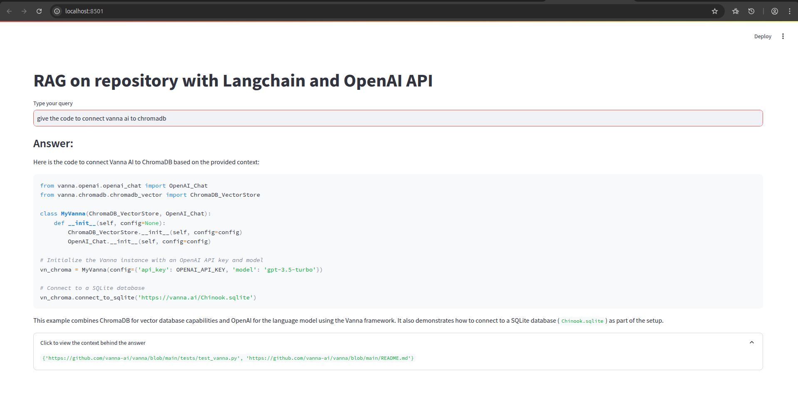

# RAG-on-repository

A **RAG (Retrieval-Augmented Generation)** application that answers users' queries based on documents from a repository.

---

## Explanation of Files

### 1. `requirements.txt`
- Contains the Python packages required to run the application.

### 2. `generate_embeddings.py`
- Generates embeddings for your documents and saves them to the specified `faiss_index` path.

### 3. `server_llm.py`
- Loads and initializes the embeddings, the language model (LLM), prompts, and the retrieval chain.

### 4. `app.py`
- A FastAPI application that imports `server_llm.py` to create a POST route and expose the API.

### 5. `client.py`
- Acts as a client application using **Streamlit**.
- Builds a simple web interface to connect with the FastAPI backend and serve as a frontend to the user.

### 6. `Dockerfile`
- Contains the configuration to build a Docker image for the FastAPI application.

---

## Technologies Used

- [Python](https://www.python.org/)
- [LangChain](https://www.langchain.com/)
- [OpenAI](https://platform.openai.com/)
- [FAISS](https://faiss.ai/)
- [FastAPI](https://fastapi.tiangolo.com/)
- [Docker](https://www.docker.com/)
- [Streamlit](https://streamlit.io/)

---

## Reasons for Using the below Technologies

### 1. **FAISS (Facebook AI Similarity Search)**

- **Why FAISS?**
    - FAISS was chosen as the vector database due to limitations with open-source alternatives and its compatibility with LangChain.
    - High-performance state-of-the-art approximation techniques allow FAISS to handle billions of vectors efficiently while maintaining low memory consumption.
    - Proven track record in LLM applications with widely available documentation.

### 2. **text-embedding-3-small-1**
- Used because of limited resource availability but provides increased computation speed compared to local embeddings.

---

## How to Run the Application

### Step 1: Generate Embeddings
To generate embeddings based on new content from the repository, run the following command:

```python
python3 generate_embeddings.py
```

This command will clone the repository if it is not already present and then generate and store the embeddings.

**Note:** Pre-generated embeddings are already available and stored in the directory `faiss_index/`

### Step 2: Build the Docker Image
Run the following command to build a Docker image for the FastAPI application:

```bash
docker build -t fastapi-app .
```

What this command will do:
- Pull the base Python image.
- Copy the necessary project files into the container.
- Install all required Python packages.
- Expose port `8000` for the API.
- Start the FastAPI server.

---

### Step 3: Run the Docker Container
Start the Docker container with the following command:

```bash
docker run -p 8000:8000 fastapi-app
```

This command runs the image as a container and exposes port `8000` on `localhost`.

---

### Step 4: Run the Client Application
To start the web-based Streamlit frontend:

1. Install Streamlit if it’s not already installed:

    ```bash
    pip3 install streamlit
    ```

2. Run the client application:

    ```bash
    streamlit run client.py
    ```

---

## Screenshot

Below is an example screenshot showcasing the working application using the Streamlit client interface:



---

## Efficiency

**Indexing:**
- Embedding all the chunks extracted from the repository took an average of **`9 minutes`**. This was due to the limitation of not being able to pass all the chunks at once. Instead, the process involved looping through the chunks and adding the embedded data to the database incrementally.

**Querying:**
- Querying the FAISS database (e.g., for a question like "What is Vanna?") took an average of **`1.1135 seconds`**.

---

## References

- [LangChain Source Code for Document Loaders](https://python.langchain.com/v0.2/docs/integrations/document_loaders/source_code/)
- [LangChain GenericLoader API Reference](https://python.langchain.com/v0.2/api_reference/community/document_loaders/langchain_community.document_loaders.generic.GenericLoader.html)
- [FAISS Documentation](https://python.langchain.com/v0.1/docs/integrations/vectorstores/faiss/)
- [FastAPI Data Models](https://fastapi.tiangolo.com/tutorial/body/#create-your-data-model)